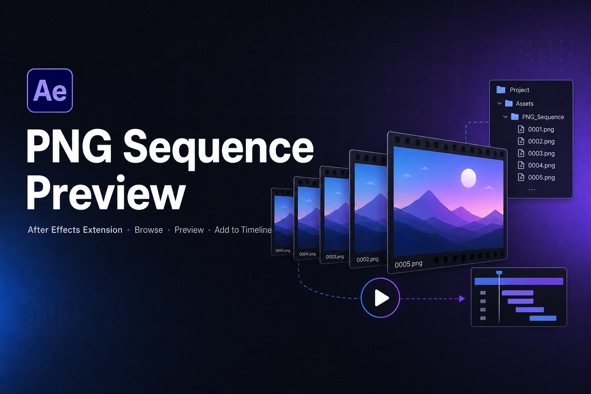
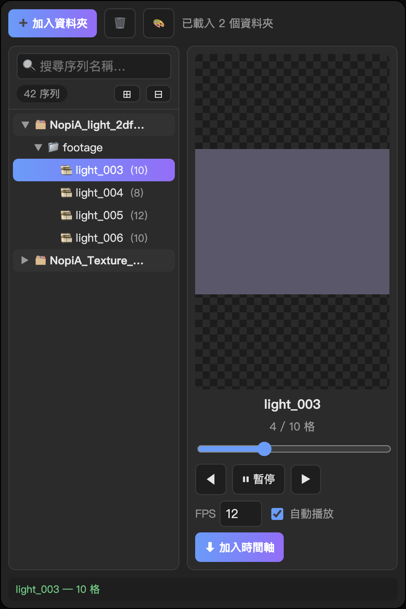
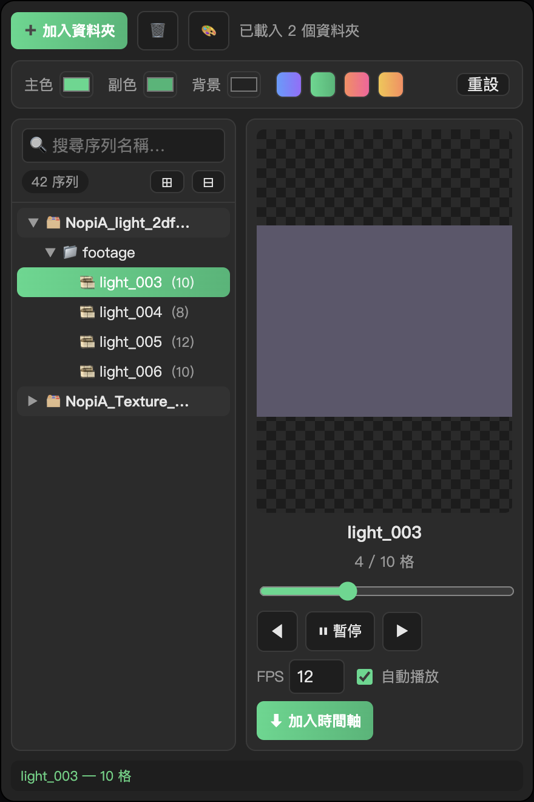

  

<h1 align="center">PNG 序列預覽 · PNG Sequence Preview</h1>

  <b>After Effects 擴充面板 — 瀏覽 · 預覽 · 加入時間軸</b> 
  An After Effects extension to browse, preview & add PNG sequences to the timeline

  
  
  

  <a href="#-繁體中文">🇹🇼 繁體中文</a> ·
  <a href="#-english">🇬🇧 English</a> ·
  <a href="#-日本語">🇯🇵 日本語</a> ·
  <a href="#-русский">🇷🇺 Русский</a>

  
  &nbsp;
  

## 📥 Download / 下載 / ダウンロード / Скачать

前往 **[Releases](https://github.com/Marcycuteaf/ae-png-sequence-preview/releases/latest)** 下載最新的 `PNG-Sequence-Preview.zxp`，用 [aescripts ZXP Installer](https://aescripts.com/learn/zxp-installer/) 安裝即可。
Grab the latest `PNG-Sequence-Preview.zxp` from **[Releases](https://github.com/Marcycuteaf/ae-png-sequence-preview/releases/latest)** and install it with a ZXP installer.

---

## 🇹🇼 繁體中文

### ✨ 工具看點
- 🗂 **多資料夾同時載入**：一次掛上多個素材包，樹狀分組一目了然。
- 🌳 **巢狀樹狀瀏覽**：自動掃描多層子資料夾，`📁` 資料夾、`🎞` 序列（顯示張數）。
- 🔍 **即時搜尋**：上百個序列也能秒搜秒定位。
- ▶️ **選中即自動播放**：切換序列立即循環預覽，可逐格拖曳、調 FPS。
- ⬇️ **一鍵加入時間軸**：匯入並加到目前合成、圖層對齊**播放頭 (current time)**。
- 🗃 **自動分類資料夾**：依素材包名稱在專案面板自動建立 bin 並歸位。
- 🎨 **介面配色自訂**：主色／副色／背景隨你調，附預設配色。
- 💾 **記憶設定**：載入的資料夾與配色，**下次開 AE 自動還原**。

### 🚀 安裝
1. 安裝 [aescripts ZXP Installer](https://aescripts.com/learn/zxp-installer/)。
2. 把 `PNG-Sequence-Preview.zxp` 拖進去安裝。
3. 重啟 AE → **Window ▸ Extensions ▸ PNG 序列預覽**。

### 🕹 操作
1. 點 **➕ 加入資料夾** 選素材根目錄（可多次加入）。
2. 左側樹中點序列即在右側預覽並自動播放；`◀ ▶` 或 `↑ ↓` 切換序列、`空白鍵` 播放/暫停。
3. **雙擊序列**或按 **⬇ 加入時間軸**：加到目前合成的播放頭位置，並自動建立分類資料夾。
4. 點 **🎨** 調整介面顏色。

> ⚠️ 需 AE 2019–2025+（macOS）。若選單看不到面板，請重啟 AE；手動安裝者需開啟 PlayerDebugMode。

---

## 🇬🇧 English

### ✨ Highlights
- 🗂 **Load multiple folders at once** — mount several asset packs, grouped in a tree.
- 🌳 **Nested tree browser** — recursively scans subfolders; `📁` folders, `🎞` sequences (with frame count).
- 🔍 **Instant search** — find any sequence among hundreds in a flash.
- ▶️ **Auto-play on select** — switching a sequence loops it instantly; scrub frame-by-frame, set FPS.
- ⬇️ **One-click add to timeline** — imports and adds to the active comp, layer aligned to the **current playhead time**.
- 🗃 **Auto-categorized bins** — a project folder named after the pack is created automatically.
- 🎨 **Custom UI colors** — tweak primary / secondary / background, with presets.
- 💾 **Remembers everything** — loaded folders and theme are **restored next time you open AE**.

### 🚀 Install
1. Install the [aescripts ZXP Installer](https://aescripts.com/learn/zxp-installer/).
2. Drag `PNG-Sequence-Preview.zxp` into it.
3. Restart AE → **Window ▸ Extensions ▸ PNG 序列預覽**.

### 🕹 Usage
1. Click **➕ Add Folder** and pick a root folder (add as many as you like).
2. Click a sequence in the tree to preview & auto-play; use `◀ ▶` / `↑ ↓` to switch, `Space` to play/pause.
3. **Double-click a sequence** or press **⬇ Add to Timeline** — it lands at the playhead and gets auto-filed into a bin.
4. Click **🎨** to customize the interface colors.

> ⚠️ Requires AE 2019–2025+ (macOS). If the panel is missing, restart AE; manual installs need PlayerDebugMode.

---

## 🇯🇵 日本語

### ✨ ツールの特長
- 🗂 **複数フォルダーを同時に読み込み** — 複数の素材パックをツリーでグループ表示。
- 🌳 **ネストしたツリー表示** — サブフォルダーを再帰的にスキャン（`📁` フォルダー、`🎞` シーケンス・枚数表示）。
- 🔍 **インスタント検索** — 数百のシーケンスから瞬時に絞り込み。
- ▶️ **選択で自動再生** — シーケンスを切り替えると即ループ再生。コマ送り・FPS 調整も可能。
- ⬇️ **ワンクリックでタイムラインへ** — 読み込んでアクティブなコンポに追加、レイヤーは**再生ヘッド（現在時間）**に揃います。
- 🗃 **自動フォルダー分類** — パック名のビンをプロジェクトに自動作成して整理。
- 🎨 **UI カラーのカスタマイズ** — メイン／サブ／背景色を自由に変更（プリセット付き）。
- 💾 **設定を記憶** — 読み込んだフォルダーと配色は **次回 AE 起動時に自動復元**。

### 🚀 インストール
1. [aescripts ZXP Installer](https://aescripts.com/learn/zxp-installer/) をインストール。
2. `PNG-Sequence-Preview.zxp` をドラッグして導入。
3. AE を再起動 → **Window ▸ Extensions ▸ PNG 序列預覽**。

### 🕹 使い方
1. **➕ フォルダー追加** でルートフォルダーを選択（複数追加可）。
2. ツリーでシーケンスをクリックすると右側でプレビュー＆自動再生。`◀ ▶` / `↑ ↓` で切替、`スペース` で再生/停止。
3. シーケンスを**ダブルクリック**または **⬇ タイムラインへ** を押すと、再生ヘッド位置に追加され、ビンへ自動整理。
4. **🎨** で UI の色を変更。

> ⚠️ AE 2019–2025+（macOS）が必要。パネルが出ない場合は AE を再起動。手動インストールは PlayerDebugMode が必要です。

---

## 🇷🇺 Русский

### ✨ Возможности
- 🗂 **Загрузка нескольких папок сразу** — подключите несколько паков, сгруппированных в дереве.
- 🌳 **Вложенное дерево** — рекурсивное сканирование подпапок (`📁` папки, `🎞` секвенции с числом кадров).
- 🔍 **Мгновенный поиск** — находите нужную секвенцию среди сотен за секунду.
- ▶️ **Автовоспроизведение при выборе** — переключение секвенции сразу запускает цикл; покадровая перемотка и настройка FPS.
- ⬇️ **Добавление на таймлайн в один клик** — импорт и добавление в активную композицию, слой выровнен по **текущему положению плейхеда**.
- 🗃 **Автоматические папки-категории** — в проекте создаётся бин с именем пака.
- 🎨 **Настройка цвета интерфейса** — основной / дополнительный / фон, с пресетами.
- 💾 **Запоминает настройки** — загруженные папки и тема **восстанавливаются при следующем запуске AE**.

### 🚀 Установка
1. Установите [aescripts ZXP Installer](https://aescripts.com/learn/zxp-installer/).
2. Перетащите в него `PNG-Sequence-Preview.zxp`.
3. Перезапустите AE → **Window ▸ Extensions ▸ PNG 序列預覽**.

### 🕹 Использование
1. Нажмите **➕ Добавить папку** и выберите корневую папку (можно несколько).
2. Кликните секвенцию в дереве — превью и автовоспроизведение справа; `◀ ▶` / `↑ ↓` для переключения, `Пробел` — play/pause.
3. **Двойной клик** по секвенции или кнопка **⬇ На таймлайн** — добавит её в позицию плейхеда и разложит по бинам.
4. Нажмите **🎨**, чтобы настроить цвета интерфейса.

> ⚠️ Требуется AE 2019–2025+ (macOS). Если панели нет в меню — перезапустите AE; для ручной установки нужен PlayerDebugMode.

---

Bundle ID <code>com.marcy.pngseq</code> · v1.0.0 · Made with ♥ for motion designers

