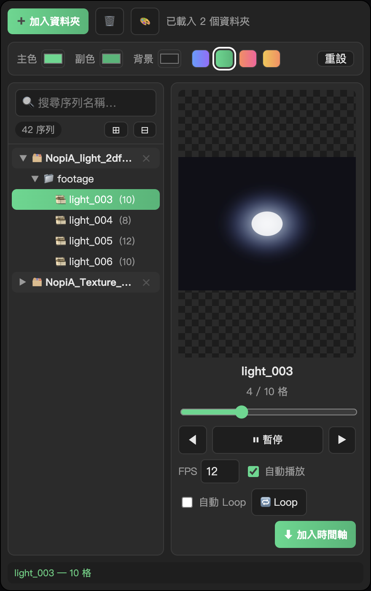

  

<h1 align="center">PNG Sequence Preview</h1>

  
  
  
  

  
  &nbsp;
  

---

## 📥 Download

Go to **[Releases](https://github.com/Marcycuteaf/ae-png-sequence-preview/releases/latest)** and pick the file for your OS:

| Platform | File |
| --- | --- |
| **macOS** | `PNG-Sequence-Preview-v1.0.4-macOS.zxp` or `-macOS.zip` |
| **Windows** | `PNG-Sequence-Preview-v1.0.4-Windows.zxp` or `-Windows.zip` |

Install with [aescripts ZXP Installer](https://aescripts.com/learn/zxp-installer/), then restart After Effects → **Window ▸ Extensions ▸ PNG 序列預覽**.

> Both ZXP builds are **identical** (universal CEP). Filenames are labeled for convenience only.

---

## 🌐 Documentation

Pick a language — each link opens a **single-language** guide (interface tour, install, usage):

| Language | Guide |
| --- | --- |
| 🇹🇼 **繁體中文** | [docs/readme/zh-TW.md](docs/readme/zh-TW.md) |
| 🇬🇧 **English** | [docs/readme/en.md](docs/readme/en.md) |
| 🇯🇵 **日本語** | [docs/readme/ja.md](docs/readme/ja.md) |
| 🇷🇺 **Русский** | [docs/readme/ru.md](docs/readme/ru.md) |

---

## 📋 Changelog (recent)

### v1.0.4
- 🪟 Windows: Explorer-style folder picker (TopMost, `start /wait`), fixed false “cancelled” on CEP picker
- 🔧 **Shift + click** “Add folder” for debug info; logs in `%TEMP%\pngseq_pick_log.txt`

### v1.0.3
- 🪟 Windows: picker writes result to temp file (stdout fix)

### v1.0.2
- 🪟 Windows: Explorer large-window folder dialog

### v1.0.1
- 🪟 Windows: preview path / file URL fix; native folder picker; **Loop** button + auto Loop

---

Bundle ID <code>com.marcy.pngseq</code> · v1.0.4 · macOS &amp; Windows

