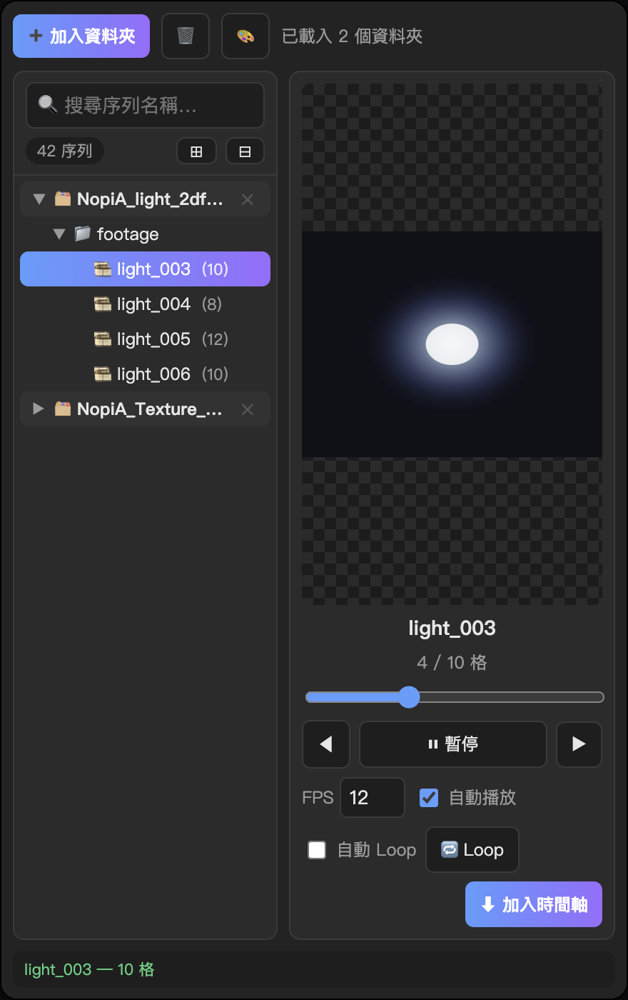

# PNG シーケンスプレビュー

After Effects 拡張パネル — PNG シーケンスの閲覧・プレビュー・タイムライン追加

[← README](../../README.md) · [繁體中文](zh-TW.md) · [English](en.md) · [Русский](ru.md)

  

---

## 機能

- 複数フォルダー、ネストツリー、検索
- 選択で自動プレビュー、コマ送り、FPS 調整
- ワンクリックでタイムラインへ（再生ヘッド位置）
- 自動ビン分類、UI 配色
- Loop ボタンと自動 Loop

---

## インターフェース

| エリア | 説明 |
| --- | --- |
| 上部 | フォルダー追加、クリア、配色 |
| 左 | 検索、シーケンスツリー |
| 右 | プレビュー、再生、FPS、Loop、タイムラインへ |
| 下部 | ステータスバー |

**Windows：** Shift + 「フォルダー追加」でデバッグ情報。

---

## インストール

1. [Releases](https://github.com/Marcycuteaf/ae-png-sequence-preview/releases/latest) から `.zxp` をダウンロード
2. [ZXP Installer](https://aescripts.com/learn/zxp-installer/) で導入
3. AE 再起動 → **Window → Extensions → PNG 序列預覽**

---

## 使い方

1. **フォルダー追加** でルートを選択
2. ツリーでシーケンスをクリック → プレビュー
3. ダブルクリックまたは **タイムラインへ**

---

## 動作環境

After Effects 2019–2025+ · macOS / Windows
